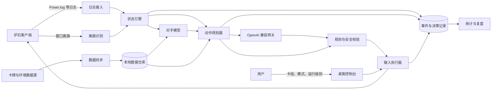

# 系统架构设计

## 1. 架构目标

系统必须把“观察”“理解”“决策”和“执行”分开。任何模型输出都不能直接变成鼠标操作，任何输入动作都必须能追溯到确定的状态、合法动作和决策记录。

## 2. 系统上下文

## 3. 核心原则

1. **事件溯源**：原始事件是事实，`GameState` 是事件归约后的可重建视图。
2. **确定性优先**：费用、目标、斩杀和动作合法性由本地规则处理。
3. **显式不确定性**：未知信息使用概率或 `Unknown`，不能填入未经证实的值。
4. **最小权限**：只读取获准的日志、窗口画面和本地配置，只在前台目标窗口执行普通输入。
5. **失败关闭**：任何关键检查失败时关闭自动执行，而不是降低标准继续点击。
6. **版本隔离**：卡牌、规则、环境快照和模型提示都绑定版本。

## 4. 逻辑组件

| 组件 | 职责 | 不负责 |
| --- | --- | --- |
| 配置与凭据 | 服务配置、运行模式、阈值、密钥引用 | 保存明文密钥、制定策略 |
| 客户端监督器 | 发现窗口、焦点检查、进程生命周期、全局停止 | 读取进程内存、规避检测 |
| 日志接入器 | 增量读取、轮转处理、解析为标准事件 | 推断策略 |
| 画面识别器 | 识别模式界面、发现选项、弹窗和可视状态 | 代替所有日志状态 |
| 状态引擎 | 按序归约事件、维护置信度、生成快照 | 调用鼠标输入 |
| 卡牌目录 | 版本化卡牌定义、关系和效果标签查询 | 在线抓取环境卡组 |
| 环境同步器 | 拉取、校验、规范化、去重和创建每日快照 | 直接修改历史快照 |
| 对手模型 | 维护卡组原型分布、秘密和未知卡记录 | 声称知道未公开手牌 |
| 动作规划器 | 构造合法动作序列、搜索和评分 | 操作客户端坐标 |
| 模型网关 | OpenAI 兼容调用、能力适配、预算和脱敏 | 绕过本地合法性检查 |
| 决策守卫 | 验证状态版本、动作合法性、风险和时间预算 | 生成战略 |
| 输入执行器 | 高层动作映射为输入，执行前后确认 | 自行选择替代动作 |
| 对局记录器 | 持久化事件、状态摘要、决策、执行和结果 | 存储未脱敏密钥 |
| 报告服务 | 聚合日报、对局矩阵、异常和成本 | 修改原始记录 |

## 5. 推荐部署形态

MVP 采用本机单用户架构，逻辑上拆成三个进程边界：

- **Agent Host**：日志、状态、卡牌查询、规划、模型网关、记录和调度。
- **Desktop Console**：配置、卡组选择、状态展示、建议、暂停和人工确认。
- **Input Worker**：权限最小的输入执行进程，只接受已签名且短期有效的高层动作请求。

三者仅监听本机接口。Input Worker 与核心分离，可以在模型或 UI 异常时被监督器独立终止。

## 6. 技术基线建议

编码前通过小型技术验证确认最终栈。当前推荐基线为：

- Windows 原生宿主与核心：.NET 8 / C#。
- 桌面界面：WPF；如果后续确认跨平台需求，再评估 Avalonia 或 Web UI。
- 本地数据库：SQLite，启用 WAL，并通过迁移管理结构版本。
- 画面采集：Windows Graphics Capture；识别层使用 OpenCV/OCR 的可替换适配器。
- 模型访问：标准 HTTP 客户端，实现 OpenAI Chat/Responses 风格的兼容适配层。
- 报告：先生成本地 Markdown/JSON，稳定后再增加可视化页面。

选择 .NET 的主要原因是目标只在 Windows 运行，日志监控、窗口生命周期、全局热键和普通输入控制更容易保持统一。若技术验证表明关键识别库更适合 Python，应将 Python 限制在独立识别 Worker 中，核心协议保持不变。

## 7. 关键数据流

### 7.1 启动

1. 读取非敏感配置，并从系统凭据存储解析密钥引用。
2. 检查卡牌数据、规则数据和游戏构建号是否兼容。
3. 检测游戏日志位置、客户端窗口、语言和缩放比例。
4. 连接模型服务并做能力探测，但探测失败不阻止观察模式。
5. 用户选择卡组、模式和运行级别。
6. 在所有条件满足前，输入执行器保持锁定。

### 7.2 对局开始与换牌

1. 日志接入器产生 `MatchStarted`、玩家和实体事件。
2. 状态引擎确认英雄、先后手、起始手牌和预期卡组。
3. 对手模型根据环境快照建立初始原型分布。
4. 换牌规划器生成保留/替换方案，模型可提供战略排序。
5. 决策守卫确认仍处于换牌阶段，再允许展示或执行方案。

### 7.3 回合循环

1. 新事件进入追加式事件流，并产生新的状态版本。
2. 对手模型根据具有可信来源的公开卡牌更新概率。
3. 规划器在当前状态版本上生成动作序列，先检查确定性斩杀。
4. 模型网关只接收完成决策所需的最小结构化上下文。
5. 决策守卫重新确认回合、时间、窗口、状态版本和动作合法性。
6. 执行器逐步输入，每一步等待预期事件或画面确认。
7. 如果发生状态漂移，立即中断剩余序列并重新规划。

### 7.4 对局结束

1. 以日志结果为主、画面结果为辅确认胜负和结束原因。
2. 固化本场使用的卡牌、环境、规则和模型配置版本。
3. 更新统计聚合，不直接在线修改策略权重。
4. 将低置信度卡组、状态冲突和执行失败加入人工复核队列。

## 8. 内部契约

跨组件消息至少携带：

- `schemaVersion`
- `matchId`
- 单调递增的 `sequence`
- `stateVersion`
- UTC 时间和游戏内时间
- 数据来源与置信度
- 游戏构建号、卡牌快照和规则版本
- 关联决策或动作 ID

关键命令采用幂等设计。执行命令还需要短过期时间、预期窗口标识、预期回合和前置状态摘要；过期命令一律拒绝。

## 9. 存储分层

- **原始层**：经过脱敏的日志片段、识别结果及来源信息，只追加。
- **事件层**：规范化 `GameEvent`，可用于确定性重放。
- **状态层**：周期状态快照，提高回放和恢复速度。
- **知识层**：卡牌版本、规则标签、卡组原型和每日环境快照。
- **决策层**：候选路线、评分、模型交互摘要和执行结果。
- **分析层**：日报及胜率聚合，可以从事实数据重新生成。

## 10. 故障与降级

| 故障 | 系统行为 |
| --- | --- |
| 模型超时 | 使用仍然安全的本地确定性结果，否则切换到建议/暂停 |
| 日志中断或乱序 | 暂停输入，等待补齐并重放；不能恢复则结束自动模式 |
| 画面识别低置信度 | 不执行依赖该识别结果的动作，提示校准 |
| 游戏窗口失焦 | Input Worker 拒绝输入，等待用户恢复 |
| 卡牌或规则版本不匹配 | 只允许观察和记录，禁止自动决策执行 |
| 每日数据源失败 | 使用最近一次有效快照并明确标记陈旧时间 |
| 动作执行结果不符 | 中断后续动作、记录证据、重新同步，不自动补点 |
| 数据库损坏 | 切换只读或停止，保留文件供恢复，不创建相互矛盾的新历史 |

## 11. 可观测性

日志采用结构化记录并关联 `matchId`、`decisionId` 和 `actionId`。至少暴露：

- 当前状态版本和置信度。
- 事件接入延迟及解析失败数。
- 决策耗时、搜索节点数和模型调用耗时。
- 输入成功率、重试数和状态漂移数。
- 数据快照版本、陈旧时间和同步错误。
- 自动执行的暂停原因。

普通日志不得包含 API Key、完整认证头或不必要的用户目录。原始截图默认关闭，启用后必须有保留周期和一键清理能力。
